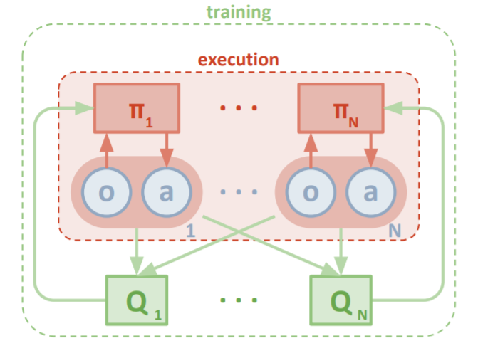
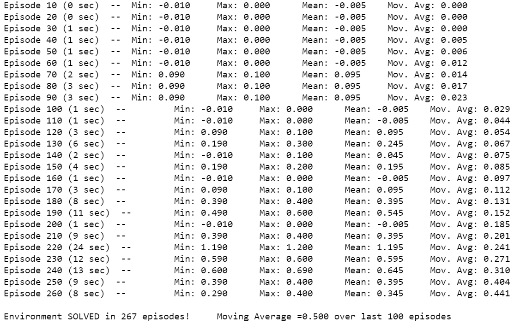
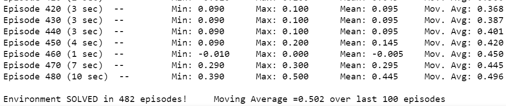
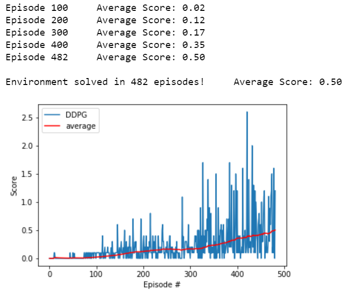
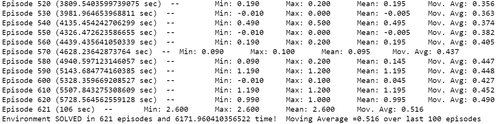
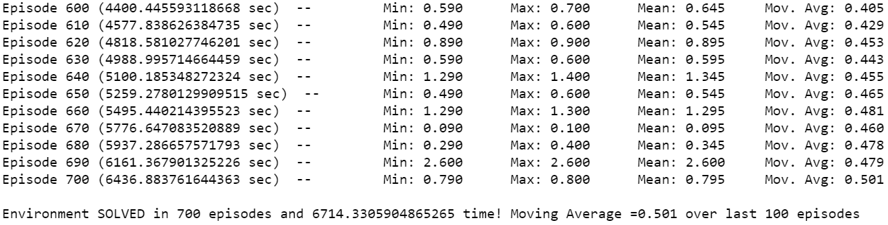
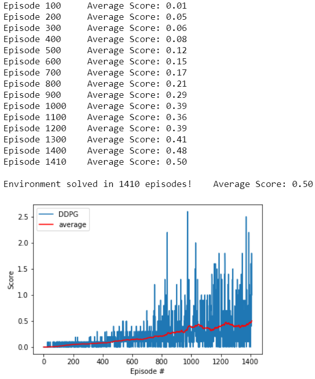
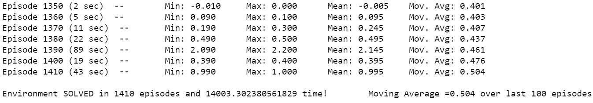

[//]: # (Image References)

[Trained_Agent]: https://user-images.githubusercontent.com/10624937/42135623-e770e354-7d12-11e8-998d-29fc74429ca2.gif "Trained Agent"

# DRL-Multi-Agent Collaboration & Competition-P3-Report
Project 3 Udacity's Deep RL nanodegree Report

##### &nbsp;
## Contents

1. Goal, State & Action Space.
2. Multi-Agent RL
3. MADDPG
4. MAPPO
5. Single (or Double) Agent DDPG, PPO
6. Possible Future Improvements and Directions

##### &nbsp;
## 1. Goal, State & Action Space
For this project, we will work with the [Tennis](https://github.com/Unity-Technologies/ml-agents/blob/master/docs/Learning-Environment-Examples.md#tennis) environment. We will try to implement various algorithms to solve the environment.

![Trained Agent][Trained_Agent]

In this environment, two agents control rackets to bounce a ball over a net. If an agent hits the ball over the net, it receives a reward of +0.1.  If an agent lets a ball hit the ground or hits the ball out of bounds, it receives a reward of -0.01.  Thus, the goal of each agent is to keep the ball in play (collaboration).

The observation space consists of 8 variables corresponding to the position and velocity of the ball and racket. Each agent receives its own, local observation, which is 24 dimensional. Two continuous actions are available, corresponding to movement toward (or away from) the net, and jumping, hence each action is described by two continuous numbers between -1 and 1. 

The task is episodic, and in order to solve the environment, our agents must get an average score of +0.5 (over 100 consecutive episodes, after taking the **maximum** over both agents). Specifically,

- After each episode, we add up the rewards that each agent received (without discounting), to get a score for each agent. This yields 2 (potentially different) scores. We then take the *maximum* of these 2 scores.
- This yields a single **score** for each episode.

The environment is considered solved, when the average (over 100 episodes) of those **scores** is at least +0.5.

##### &nbsp;
## 2. Multi-Agent RL
In previous projects, we trained a *single* agent to learn a task. In a *multi-agent* environment, we are dealing with multiple agents observing and acting all together. Therefore the environement is best described as a **Markov game** with `<n,S,A_1,...,A_n,O_1,...,O_n,R_1,...,R_n,pi_1,...,pi_n,T>` where:
- `n`: The number of agents
- `S`: The set of states
- `A_i`: The set of actions of agent `i`
- `O_i`: The set of observations of agent `i`
- `R_i`: The rewards for agent `i`
- `pi_i`: The policy for agent `i`
- `T`: The probability transition function `T:S * A ---> S` where `A = prod_{i=1}^n A_i` the set of product of all actions.

To train the agents, here are some possible approaches using previous single agent methods we have learned so far:
1- **Train them separately**: Each agent sees the others as part of the environment:
    - If using an offline-based method (using experience replay),  each agent's policy is changing as training progresses, so the environment becomes non-stationary from the perspective of any individual agent (in a way that is not explainable by changes in the agent’s own policy). Notice stationarity is assumed in most single agent RL algorithms as it is necessary for the convergence guarantees to hold.
    - If using an online-based method, the agent exhibits even higher variance as it tries to coordinate with other agents. As `R_i` is actually dependent on `pi_j` for `j` not equal to `i` , optimizing `R_i` solely based on `pi_i` is not possible and introduces a lot of variance.
2- **Meta-agent approach**: This takes into account all agents. A single policy `pi: S ---> prod A_i` is computed for all agents and gives in return an action for each agent. In this setting, we have typically a global reward in return, i.e. a function `R` from `S * A` to real numbers. The disadvantages are:
    - `A` increases exponentially with the number of agents.
    - Each agent may have different observation of the environment state (if they see the environment locally or have partial observations), so it will be difficult to set a disambiguous state from local observations. So this approach works **only** when each agent knows everything about the environment.
3- **Self-play approach**: This approach may actually work in certain circumstances and will turn out to be the best one in this project. Imagine a single brain (e.g. DQN, DDPG, PPO, etc.) which gets the observation of each agent and outputs an action for each agent. There are usually two scenarios in this approach:
    - When the agents have to take turn to act. In this case, no matter whether the environment is collaborative or competitive (like in a zero-sum game such as Go or Chess), the single brain will take the perspective of each agent in their respective turn, i.e. it takes as input the observation of the respective agent, and tries to make the best move as if it were that agent. It should be noted that if the environment is competitive (e.g. if first player wins, reward is +1, while if it loses, reward is -1), then the rewards of the second player need to be changed by a negative sign if we are computing the total reward for the first player. A famous example of this method augmented by a Monte-Carlo Tree Search can be found [here](https://arxiv.org/abs/1712.01815).
    - When the agents act simultaneously, which is the case in our project. Then the brain will have to take both observations (like a batch of dimension 2) and output the actions for each agent. Notice *symmetry* is vital for this algorithm to work; if the blue and red agent's observations are exchanged, the best move and the reward should also be exchanged. Hence there should not be any *real* difference between the blue and the red agent. This is obviously the case in this project.

As explained above, the second and third method have some potential in some settings, while the first method does not seem so. How we can improve on that is explained in the next two sections for each of the offline and online-based method.

##### &nbsp;
## 3. MADDPG

### 3.1. MADDPG Review
DDPG (Deep Deterministic Policy Gradient) is an offline deterministic actor-critic algorithm. We refer to [the previous project](https://github.com/mojtabashokrian/DRL-Continuous_Control-P2/blob/master/Report.md) for more on this algorithm and assume the reader is familiar with the details. The multi-agent version of DDPG, called *MADDPG* was introduced by [Ryan Lowe et. al., 2017](https://arxiv.org/abs/1706.02275). The idea is to have a **centralized training**, where each agent critic takes into account the whole environment while training, with a **decentralized execution**, where each agent acts based only on its local observation. 

Similar to DDPG, we will have an actor network for each agent, which takes as input the local observation `o_i` and outputs (deterministically) an action `pi_{theta_i}(o_i)`, with `theta_i` the actor network parameters. The critic part is where the critic network of each agent takes as input *all states and all actions* `(o_1,...,o_n,a_1,...,a_n)`, and outputs the action-value `Q_{w_i}(o_1,...,o_n,a_1,...,a_n)`, with `w_i` the critic network parameters.  



Of course, as it is an offline-based method, to stabilize the training, we must implement a Replay Buffer and have a local and target version of each network (`4n` networks in total).

There are multiple ways to augment this algorithm as described in [Ryan Lowe et. al., 2017](https://arxiv.org/abs/1706.02275):
- We could try to let each agent *learn* the policies of other agents by observation, which is perhaps more *human-like*, where we estimate how our opponent or collaborator operates. This is accomplished by training a `pi_i^j` approximator of `pi_j`by actor `i`. The loss for that would be given by maximizing the expected log probability `log(pi_i^j(a_j|o_j))` while being regularized by an entropy term `lambda* H(pi_i^j)`. Of course, the critic will then take its action inputs **not** directly from the actors of other agents, but from the approximations it is making, hence `Q_{w_i}(o_1,...,o_n,pi_i^1(o_1), ... , pi_i^n(o_n))`. For further details, see [Ryan Lowe et. al., 2017](https://arxiv.org/abs/1706.02275) section 4.2.
- One issue of this algorithm is that the agents could overfit to a strategy. This would make them fail if their competitors have a slight change in their policies. To alleviate that, we can do what is called *ensemble policy learning*, where at each step we make a uniform selection of `k`-subpolicies when acting by any actor `i`. Therefore, we will have `n*k` replay buffers. For further details, see section 4.3 of the paper. This has been shown to be quite effective when put against a single policy MADDPG, as shown in Figure 3, p.7.

### 3.2. Implementation details
The implementation involves defining a `DDPG_agent` class in `DDPG_agent.py` similar to a DDPG in a single agent environment, and use `n=2` of these to build an instance of `MADDPG_agent` class in `MADDPG_agent.py`. As for the networks, all in `model.py`, the actor networks take in a `24` dimension vector (local observation) and output a two dimensional vector (action), while the critics take a `24*2+2*2=52` dimensional vector as input and output a one dimensional vector. 

The most important part of the implementation involves how to compute the loss functions. Loss functions here will be similar to DDPG:
- To implement the target of the loss function for the critic local network of agent `i`, we will have to apply the actor **target** networks of all agents to get the action corresponding to each local observation in `next_obs`, then run their result through agent `i` critic **target** network. This will give us the target in the Temporal Difference (TD) estimation. The prediction is of course `Q_{w_i}(o_1,...,o_n,a_1,...,a_n)` for observations `o_i` and actions `a_i` given by the replay buffer.
- To implement the loss function for the actor local network of agent `i`, we will compute `pi_{theta_j}(o_j)` for each of the observations `o_j` using the actor **local** network of each agent `j`, and then detach all of them from the computational graph (with the exception of agent `i` of course) and run the result through the critic **local** network of agent `i`. That woud give us the action-value `Q_{w_i}(o_1,...,o_n,pi_{theta_1}(o_1),...,pi_{theta_n}(o_n))` which we need to *maximize* (hence the negative sign behind the value).

```python
def update(self, samples, agent_number):
        """update the critics and actors of all the agents """
        obs,action,reward,next_obs,done=samples        
        agent = self.maddpg_agent[agent_number]
        agent.critic_optimizer.zero_grad()
        target_actions = self.target_act(next_obs.permute([1,0,2]))
        #target_actions shape is 2(agent)*B*2(actions) 
        target_actions = target_actions.permute([1,0,2])
        with torch.no_grad():
            q_next=agent.target_critic(next_obs,target_actions)
        y = reward.permute([1,0])[agent_number].view(-1, 1) + self.discount_factor * q_next * (1 - done.permute([1,0])[agent_number].view(-1, 1))
        q = agent.critic(obs, action)
        huber_loss = torch.nn.SmoothL1Loss()
        critic_loss = F.mse_loss(q, y.detach())
        critic_loss.backward()
#         torch.nn.utils.clip_grad_norm_(agent.critic.parameters(), 1.) #uncomment this to allow clipping
        agent.critic_optimizer.step()
        agent.actor_optimizer.zero_grad()
        ####-------actor_update---------####
        q_input = [ self.maddpg_agent[i].actor(ob) if i == agent_number \
                   else self.maddpg_agent[i].actor(ob).detach()
                   for i, ob in enumerate(obs.permute([1,0,2])) ]
        q_input=torch.stack(q_input).squeeze(dim=0).permute([1,0,2])
        actor_loss = -agent.critic(obs, q_input).mean()
        actor_loss.backward()
        agent.actor_optimizer.step()
```

Ultimately, we were unable to solve environment using MADDPG. We searched through a wide range of hyperparameters and explored different network configurations as well. For example, we can decide to either merge the actions with the state from the beginning of the forward pass in the critic network, or first send the states and then merge the result with the actions (this is implemented by `merge=False` in `MADDPG_agent()`). The code is written so that one can change almost everything using the inputs given to `MADDPG_agent()` and `MADDPG_train()`. 

With regards to the train function `MADDPG_train()`, we also tried to first collect positive rewards timesteps to pre-fill the buffer. The reason is that the positive rewards are extremely sparse and hard to obtain in this environment. We observed a bit more general idea was implemented [here](https://github.com/BDGITAI/RL_P3_COLLABORATION_COMPETITION) where the agent's buffer is half pre-filled using a *mix* of positive, neutral, and negative experiences (15%,42.5%,42.5%) and it was shown to help solve the environment. We implemented a similar mechanism in the train function (the argument `pretrain=True` does that). We were unable to replicate the results, and it may be simply because we needed more runs of the algorithm; notice multi-agent algorithms are still rather unstable and for some random seeds it may not converge and even for the same random seed it may not converge always. 
```python
if pretraining:
        pos=0
        neg=0
        neut=0
        while True:                                     
            env_info = env.reset(train_mode=True)[brain_name]     # reset the environment    
            obs = env_info.vector_observations                  # get the current state (for each agent)
            scores = np.zeros(len(env_info.agents)) 
            step=0
            if pretrain_steps > agent.buffer_size*ratio: #that's when it is pre-filled
                break
            while True:
                action = np.random.randn(len(env_info.agents), action_size) # select an action (for each agent)
                action = np.clip(action, -1, 1)                  # all actions between -1 and 1
                env_info = env.step(action)[brain_name]           # send all actions to tne environment
                next_obs = env_info.vector_observations         # get next state (for each agent)
                reward = env_info.rewards                         # get reward (for each agent)
                done = env_info.local_done                        # see if episode finished
                reward=[reward*alter_factor for reward in reward] #altering the rewards
                scores += reward                         # update the score (for each agent)
                obs = next_obs                               # roll over states to next time step
                #case-checking whether it is neutral or positive or negative and storing accordingly
                if np.mean(reward)>0. and pos/(pretrain_steps+1e-6)<0.15:
                    pretrain_steps+=1
                    agent.memory.add(obs, action, reward, next_obs, done)
                    pos= pos+1
                elif np.mean(reward)<0. and neg/(pretrain_steps+1e-6)<0.425:
                    pretrain_steps+=1
                    agent.memory.add(obs, action, reward, next_obs, done)
                    neg= neg+1
                elif np.mean(reward)==0. and neut/(pretrain_steps+1e-6)<0.425:
                    pretrain_steps+=1
                    agent.memory.add(obs, action, reward, next_obs, done)
                    neut= neut+1   
                step+=1
                if np.any(done):                                  # exit loop if episode finished
                    break
        print("pretrain_steps : {}, neg : {}, neut : {}, pos : {}" .format(pretrain_steps,neg,neut,pos))
```

Further, we tried different noises for exploration. The Ornstein-Uhlenbeck (OU) noise is implemented by default (for more details on OU noise, we refer to [the previous project](https://github.com/mojtabashokrian/DRL-Continuous_Control-P2/blob/master/Report.md)). We can decide what the scale of this noise should be in the long run: whether to let it be on its own (`noise=1.,hard_end_noise=False`) or let it decay and reach a minimum `noise_end` using `hard_end_noise=True`. We tried the Gaussian noise (set `gauss=True` in `MADDPG_agent()` to implement) as done in [here](https://github.com/ulamaca/DRLND_P3_MultiAgent_RL/blob/master/maddpg_agent.py) and it still did not work. Finally, we even explored changing the scale of the rewards by using the `alter_factor` in `MADDPG_train()`.

It needs to be mentioned that even without these augmentations, there are instances where the agent has solved the environment (e.g. see [here](https://github.com/vgudapati/DRLND_Collaboration_Competetion)). We believe that further runs of our algorithm could have provided a solution but we decided to abondon this approach and try to find a more stable one.

##### &nbsp;
## 4. MAPPO

### 4.1. MAPPO Review
The idea of Multi-Agent PPO (Proximal Policy Optimization) is very similar to MADDPG. We refer to [the previous project](https://github.com/mojtabashokrian/DRL-Continuous_Control-P2/blob/master/Report.md) for more details on PPO, which we assume the reader is familiar with the details. To make a multi-agent version of PPO, the same framework of centralized training with decentralized execution applies. The actor only takes as input its own observation and outputs an action (with its log probability as this is PPO), while the critic takes in all the states and outputs the value of that. Therefore, we will directly go the implementation details.

### 3.2. Implementation details
Similar to MADDPG, we implement a PPO agent in `PPO_agent.py` and use `n=2` of these to build an instance of the class `MAPPO_agent` in `MAPPO_agent.py`. 

Similar to the PPO implementation in [the previous project](https://github.com/mojtabashokrian/DRL-Continuous_Control-P2/blob/master/Report.md), we implement a GAE method for advantage estimation. What we observe is that since we need to collect trajectories for many episodes (as a single episode has typically really small data), and that the length of each episode can be widely different (from 13 steps to almost a hundred even at the beginning of the training), one cannot do a batch normalization of the rewards and advantages which is usually recommended for noise reduction. Perhaps there is a way around this, but we could not think of any satisfiable solution to this issue. 

Ultimately, after `n_traj` of episodes are collected, and their values, returns and advantages are calculated, they are passed to the surrogate method of `MAPPO_agent`. This computes the losses and outputs the chosen kind of loss function (similar to the previous project) from:
- `simplest`: No consideration of entropies or KL
- `entropy`: Consider both forms of entropies
- `entropy_exact`: Consider only new policy distribution entropy
- `entropy_approximate`: Consider only new policy entropy
- `KL_approximate`: Consider only new and old policy KL distance
- `KL_entropy_approximate`: merging `entropy_approximate` and `KL_approximate`
All the hyperparameters and the type of the loss function can be specified through `MAPPO_agent()` and `MAPPO_train()` functions. Even after experimenting with a wide range of hyperparameters, we were unable to solve the environment. The best result we could achieve (~0.03) was something just better than random (~0.01). It should be noted that there *is* a solution using MAPPO (see [here](https://github.com/jsztompka/MultiAgent-PPO)), but it takes a lot of episodes and uses a **beta** distribution instead of the usual normal distribution in the actor network to sample the action.  

##### &nbsp;
## 5. Single (or Double) Agent DDPG, PPO

### 5.1. DDPG, PPO Self-Play Review
The self-play approach for simultaneous action was described in the second section as a single brain taking the inputs from all agents as a batch of dimension `n=2`. The implementation of this approach is rather simple as we are dealing with a collaborative problem, hence no need to change the reward structure. Therefore, one can almost copy paste the previous project implementation of DDPG or PPO (in which we had 20 agents run in parallel and here it can be thought of two agents running in parallel), and try to find a result after some hyperparameter tuning.

On top of that, we will investigate the first approach (**Train them separately**) which is usually not recommended, as mentioned in the second section. To implement this approach, we will have two separate DDPG agents each taking as input their own observations and trained separately. It will take more time than the self-play approach, but it will be able to solve the environment using a strategy different from the self-play approach, as we will see.

### 5.2. DDPG, PPO Implementation details
Our choices for DDPG hyperparameters and network configurations were inspired by [this solution](https://github.com/mgiammatteo/udacity_drlnd_project3/blob/master/Project_3_Report.pdf). The hidden layers have size 512 and 256 with a penultimate dropout layer of `p=0.2` for the critic. The best hyperparameters were found to be 
```python
#FOR DDPG
BUFFER_SIZE = int(1e5)  # replay buffer size
BATCH_SIZE = 512        # minibatch size
GAMMA = 0.99            # discount factor
TAU = 2e-1              # for soft update of target parameters
LR_ACTOR = 1e-4         # learning rate of the actor 
LR_CRITIC = 3e-4       # learning rate of the critic
WEIGHT_DECAY = 0        # Weight_decay for Adam optimizer
UPDATE_EVERY = 5       # every update_every steps update
LEARN_NUM = 5          # learn_num times
SEED=7                 # random seed
```
which showed some stability and led in many different runs to the same solution. Notice how high the soft-update parameter `tau` is; it is usually a tenth of that. The best run was in 267 episodes:



Some other runs took more time to solve the environment:





[Here](https://youtu.be/tgcoUden60w) we can see a *perfect* play of the agents along with some other imperfect runs. Notice the strategy is to keep the rackets close to the end of the table and not move them much, instead focusing on the accuracy of each hit to reach the other end of the table.

We also managed to solve the environment with a different set of hyperparameters (different seed, almost equal `lr_critic` and `lr_actor` and lower soft-update parameter like 0.06 instead of 0.2) as it can be seen in the `Checkpoints` folder in 621 and 700 episodes, by using hidden layers of size 400-300 and no dropout.





A feature of the `DDPG_train()` function is that it can take many DDPG agents. So we can try the first method of "**Train them separately**" described in the second section. When we do so, using the same hyperparameters as our best solution, we find another strategy in 1410 epsiodes. We can see [here](https://youtu.be/vbLgDnSx1us) some plays of this algorithm, where the strategy is to hit the ball and move immediately the racket close to the net, in contrast to the previous solution. We also notice the instability in the training plot where the moving average twice went close to the 0.5 threshold only to pull back and try again later. The third time, it was successful!





We thought we could achieve similar success using PPO self-play, but it was not possible and the agent could not hit anywhere above ~0.05. The code is provided in the `PPO` folder and all hyperparameters can be tuned directly in the notebook `PPO_main.ipynb`.

##### &nbsp;
## 6. Possible Future Improvements and Directions
1- Try to understand the reasons behind the failure/significant instability of MADDPG and MAPPO. Perhaps there is a way to stabilize these algorithms, at least for the current problem. It looks like one simple reason behind the instability of the training plot, where there are spikes followed by low scores, is the fact that the next episode starts immediately after the ball hits the table, without any reset of the rackets positions! So each time after reset, we are starting from a different state than before and the rackets may be far away from the ball. Perhaps *forgetting* these episodes could be beneficial.
2- See if there is a way to batch normalize the rewards and advantages in MAPPO, as lengths of the collected episodes can be widely different. 
3- Try to solve the environment using PPO self-play; perhaps we just need a better search on the hyperparameters.
4- Finally, another project is the *soccer* problem (described in `README.md`), and we hope to work on this in the future to see how our algorithms will perform in that environment. 
